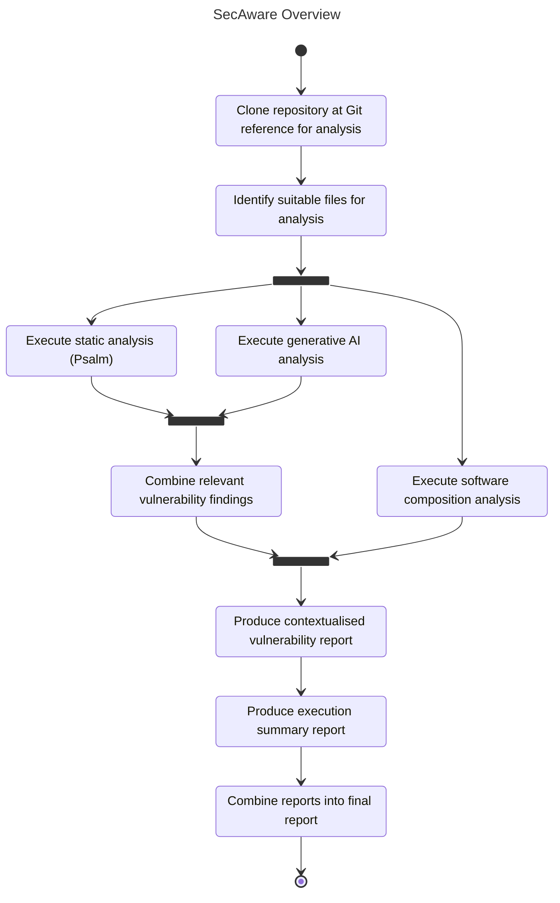
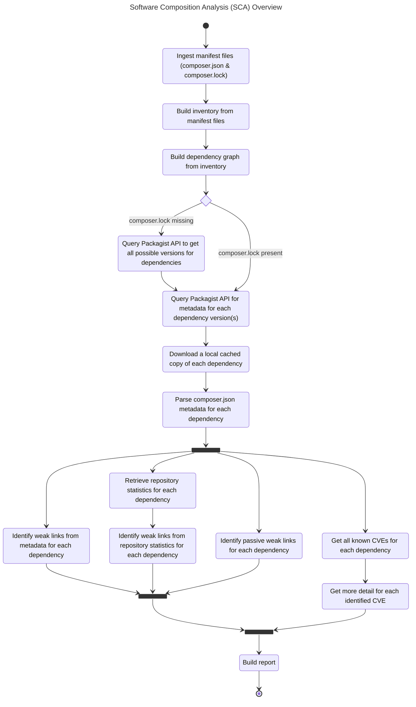
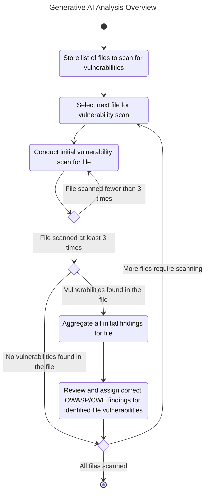

# SecAware

SecAware is a context-aware vulnerability scanner that aggregates the findings of several security analysis tools to provide better insight into software risks.

>Please note that SecAware currently only supports PHP applications.

## Pre-Requisites

### LLM Provider

SecAware uses a generative AI component to assist with vulnerability detection and provide contextualised outputs. There are a number of different options, depending on your available resources.

#### Local AI Provider via LM Studio

[LM Studio](https://lmstudio.ai/) can be used where you have adequate available local resources. Generative AI processing is resource intensive, and so you should ensure that your hardware is capable of handling suitable input and output contexts.

LM Studio should be configured with the following:

1. Enabled developer mode. [Please follow the official instructions with details on how to enable this.](https://lmstudio.ai/docs/app/user-interface/modes)
2. Within the developer window, configure the server settings so that "Serve on Local Network" is enabled. This will allow communication from your LM Studio to the Docker container of SecAware.
3. Ensure that you have downloaded the correct model to be used for analysis. SecAware has been built and tested against the [Google Gemma 3 model family](https://ai.google.dev/gemma/docs/core). More details available on [Hugging Face](https://huggingface.co/collections/google/googles-gemma-models-family).

When you intend to use SecAware, you should ensure that the LM Studio server is running with the correct loaded.

SecAware by default is configured to use LM Studio on the same host as you are executing from (`http://host.docker.internal:1234`). However, if you are using a remote LM Studio, or a different port, then you can set this with the `--ai-rest-base-url` flag.

#### Inference Provider via Hugging Face

[Hugging Face](https://huggingface.co/) is an open-source community for AI, providing resources surrounding particular models and access to inference providers. Hugging Face is a good alternative to be able to operate AI models where you may not have adequate hardware resources to be able to operate them locally.

To use Hugging Face with SecAware, you can pass in `--ai-rest-base-url https://router.huggingface.co` and the `--ai-model` flag. Successful testing has been achieved with `google/gemma-3-27b-it`, for example `./SecAware.py --ai-rest-base-url https://router.huggingface.co --ai-model google/gemma-3-27b-it`.

In order to use Hugging Face, you will need to ensure that you have created a user access token, which is available at (https://huggingface.co/settings/tokens)[https://huggingface.co/settings/tokens].

Please also note that generative AI itself is very resource-intensive. While Hugging Face provides a small amount of free credit for testing, extensive or continual use of SecAware may require sufficient account credit.

## Quick Start

Create a copy of `.env.example` as `.env`, and ensure that you populate the following values:

| Value                     | Description                                                                                                                                                                                                                                |
| ------------------------- | ------------------------------------------------------------------------------------------------------------------------------------------------------------------------------------------------------------------------------------------ |
| `AI_API_BEARER_TOKEN`     | A `Bearer` token, if required for an AI API Inference Provider, such as Hugging Face (https://huggingface.co/settings/tokens).                                                                                                             |
| `GITHUB_API_BEARER_TOKEN` | An `Authorization` token required to be able to make use of the GitHub API which is used as part of SecAware SCA component for repository analysis. A [public access PAT is required](https://github.com/settings/personal-access-tokens). |

Please use the provided [Docker](Dockerfile) container. SecAware is designed with specific assumptions regarding operating system functionalities and capabilities. Executing SecAware natively may lead to environment-related crashes or inconsistent analysis results.

```bash
# Build the container
docker build -t secaware .

# Install dependencies and run SecAware
docker run -it --rm \
    -v "$(pwd):/app" \
    -w /app \
    secaware \
    sh -c "uv pip install --system -e . && ./SecAware.py"
```

There are several options available when using SecAware, allowing you to customise its functionality to meet requirements. To see a full list of available options, pass in the `--help` flag where each will be listed with a brief description:

```bash
docker run -it --rm \
    -v "$(pwd):/app" \
    -w /app \
    secaware \
    sh -c "uv pip install --system -e . && ./SecAware.py --help"
```

## Diagrams

### SecAware Overview

Below shows a top-level view of the process that SecAware follows when conducting its analysis and producing its report.



### Software Composition Analysis (SCA) Overview

Below shows an overview of the process that the SCA component takes when conducting its analysis.



### Generative AI Analysis Overview

Below shows an overview of the process that the generative AI component conducting its analysis.


