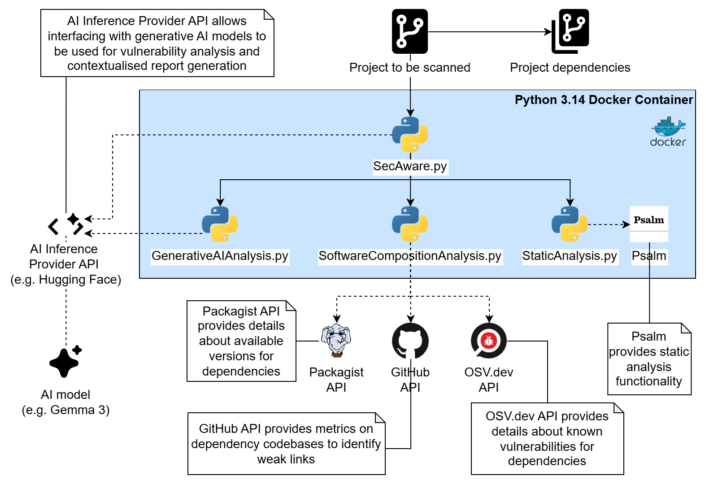
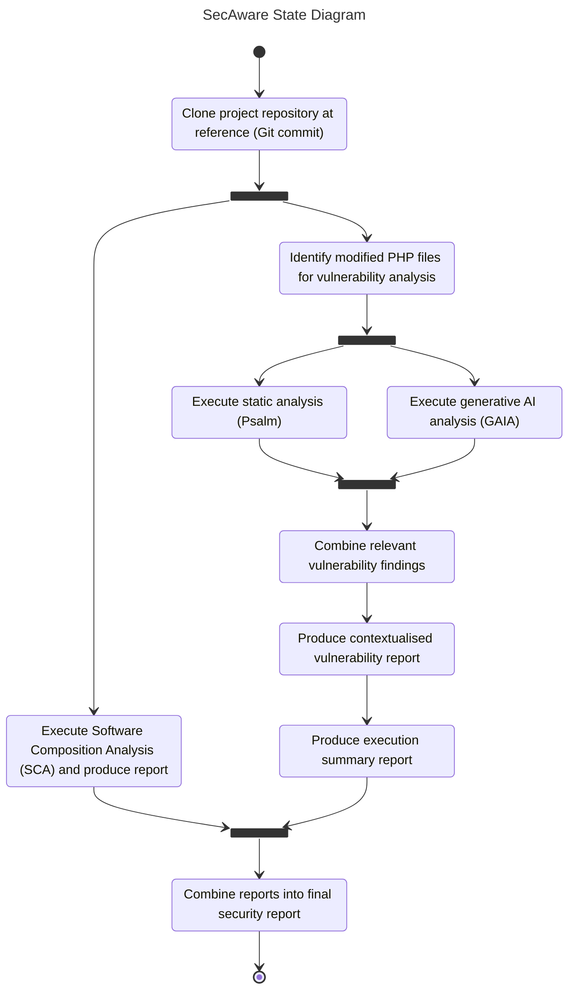
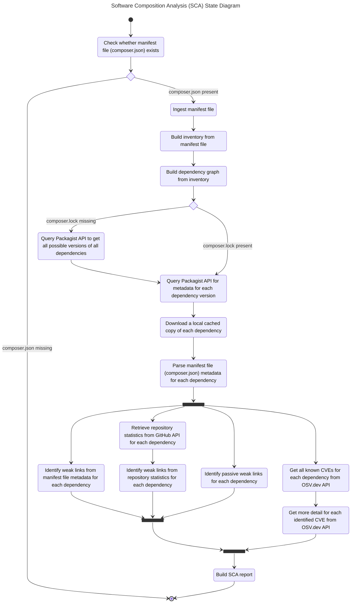
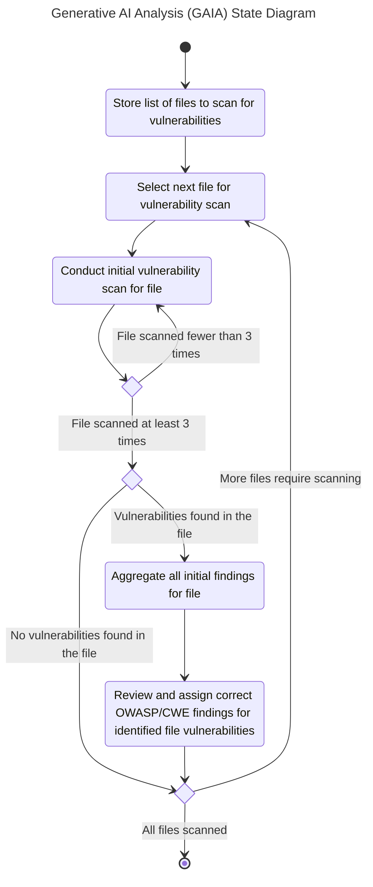

# SecAware

SecAware provides context-aware vulnerability scans of PHP applications. SecAware aggregates the findings of several security analysis tools and resources to provide better insight into software risks.

>SecAware is a prototype tool developed as part of a research project during an MSc dissertation. It is intended for demonstration and evaluation purposes and is not production-ready.

## Prerequisites

### LLM Provider

SecAware uses a generative AI component to assist with vulnerability detection and provide contextualised outputs and reports. There are a number of different options for AI support, depending on your available resources.

#### Local AI Provider via LM Studio

[LM Studio](https://lmstudio.ai/) can be used where you have adequate available local resources. Generative AI processing is resource intensive, and so you should ensure that your hardware is capable of handling suitable input and output contexts.

LM Studio should be configured with the following settings:

1. Developer mode should be enabled, [following the official instructions from LM Studio](https://lmstudio.ai/docs/app/user-interface/modes).
2. Within the developer window, configure the server settings so that `Serve on Local Network` is enabled. This will allow communication from your LM Studio to SecAware.
3. Ensure that you have downloaded the correct model to be used. SecAware has been built and tested against the [Google Gemma 3 model family](https://ai.google.dev/gemma/docs/core). More details are available on [Hugging Face](https://huggingface.co/collections/google/googles-gemma-models-family).

When you intend to use SecAware, you should ensure that the LM Studio server is running with the correct model loaded.

SecAware by default is configured to use LM Studio on the same host as you are executing from (`http://host.docker.internal:1234`). However, if you are using a remote LM Studio, or a different port, then you can set this with the `--ai-rest-base-url` flag.

#### Inference Provider via Hugging Face

[Hugging Face](https://huggingface.co/) is an open-source community for AI, providing resources surrounding particular models and access to inference providers. Hugging Face is a good alternative to be able to operate AI models where you may not have adequate hardware resources to be able to operate them locally.

To use Hugging Face with SecAware, you can pass in `--ai-rest-base-url https://router.huggingface.co` and the `--ai-model` flag. Successful testing has been achieved with `google/gemma-3-27b-it`, for example `./SecAware.py --ai-rest-base-url https://router.huggingface.co --ai-model google/gemma-3-27b-it`.

In order to use Hugging Face, you will need to ensure that you have created a user access token, which is available at https://huggingface.co/settings/tokens.

Generative AI is resource-intensive. While Hugging Face provides a small amount of free credit for testing, extensive or continual use of SecAware may require sufficient account credit.

## Quick Start

Create a copy of `.env.example` as `.env`, and ensure that you populate the following values:

| Value                     | Description                                                                                                                                                                                                                                                                                 |
| ------------------------- | ------------------------------------------------------------------------------------------------------------------------------------------------------------------------------------------------------------------------------------------------------------------------------------------- |
| `AI_API_BEARER_TOKEN`     | A `Bearer` token, if required for an AI API Inference Provider, such as Hugging Face (https://huggingface.co/settings/tokens).                                                                                                                                                              |
| `GITHUB_API_BEARER_TOKEN` | An `Authorization` token required to be able to make use of the GitHub API which is used as part of SecAware's Software Composition Analysis (SCA) component for repository and dependency analysis. A [public access PAT is required](https://github.com/settings/personal-access-tokens). |

### Docker

It is strongly recommended to use the provided [Docker](Dockerfile) container. SecAware is designed with specific assumptions regarding operating system functionalities and capabilities. Executing SecAware natively may lead to environment-related crashes or inconsistent analysis results.

Before starting you should build the container:

```bash
docker build -t secaware .
```

Once building is successfully completed, you can execute SecAware.

There are several options available when using SecAware, allowing you to customise its functionality to meet requirements. To see a full list of available options, pass in the `--help` flag where each will be listed with a brief description:

```bash
docker run -it --rm \
    -v "$(pwd):/app" \
    -w /app \
    secaware \
    sh -c "uv pip install --system -e . && ./SecAware.py --help"
```

## Example Usage

Below is an example of using the Hugging Face API, against the [`in2code-de/ipandlanguageredirect`](https://github.com/in2code-de/ipandlanguageredirect) repository, referencing commit [`b814ae1bc545187f924734c1f3ee0999153264ae`](https://github.com/in2code-de/ipandlanguageredirect/commit/b814ae1bc545187f924734c1f3ee0999153264ae). This example contains a known CWE-89 SQL injection which was reported during [CVE-2023-35782](https://nvd.nist.gov/vuln/detail/CVE-2023-35782) / [GHSA-4xf2-7qfv-mgfx](https://github.com/advisories/GHSA-4xf2-7qfv-mgfx). Please note that this assumes that the `AI_API_BEARER_TOKEN` value has been correctly set within the `.env` file.

```bash
docker run -it --rm \
    -v "$(pwd):/app" \
    -w /app \
    secaware \
    sh -c "uv pip install --system -e . && ./SecAware.py --ai-rest-base-url https://router.huggingface.co --ai-model google/gemma-3-27b-it --git-repo-url https://github.com/in2code-de/ipandlanguageredirect.git --git-commit-hash b814ae1bc545187f924734c1f3ee0999153264ae"
```

With the above execution, a report is generated which will contain any security findings. Below is an example section of the report produced by SecAware:

`````text
# Vulnerability Report

The project appears to have at least one significant vulnerability related to SQL injection. The identified issue involves direct variable interpolation into a SQL query, potentially allowing attackers to manipulate the query and gain unauthorized access or modify data.

## Findings

### File Path: Classes/Domain/Service/IpToCountry/LocalDatabase.php
- Risk Score: 8 ([High])
- Location: `$sql = 'select countryCode from ' . self::TABLE_NAME\n            . ' where inet_aton(\"' . $ipAddress . '\") >= inet_aton(ipRangeStart)' .\n            ' and inet_aton(\"' . $ipAddress . '\") <= inet_aton(ipRangeEnd) limit 1';`
- Description: SQL Injection vulnerability due to unsanitized user-supplied input being directly incorporated into a database query.
- Category: A05:2025 Injection (https://owasp.org/Top10/2025/A05_2025-Injection/)
- CWE ID(s): CWE-89
- Justification: The `$ipAddress` variable, which likely originates from an external source, is directly embedded into the SQL query string. The use of `inet_aton()` does not provide sufficient protection against malicious input, leaving the query vulnerable to manipulation.
- Remediation: Utilize prepared statements with parameterized queries. This prevents the database from interpreting the input as part of the SQL code, mitigating the risk of injection.  For example:

```php
$sql = 'SELECT countryCode FROM ' . self::TABLE_NAME . ' WHERE inet_aton(?) >= inet_aton(ipRangeStart) AND inet_aton(?) <= inet_aton(ipRangeEnd) LIMIT 1';
$stmt = $connection->prepare($sql);
$stmt->bind_param('ss', $ipAddress, $ipAddress); //Assuming $ipAddress is a string
$stmt->execute();
$result = $stmt->get_result()->fetch_column(0);
return strtolower($result);
```

## Glossary

* **SQL Injection:** A code injection technique used to attack data-driven applications, in which malicious SQL statements are inserted into an entry field for execution (e.g., to dump the database contents to the attacker).
* **Prepared Statement:** A feature used in database interactions to separate SQL code from the data, preventing injection vulnerabilities.
* **Parameterization:** The process of using placeholders within SQL queries and then providing the actual data separately, improving security.
* **CWE ID:** Common Weakness Enumeration identifier - a standardized way to categorize software vulnerabilities.
* **OWASP:** The Open Web Application Security Project – a community focused on improving the security of software.
`````

>Please note that due to the non-deterministic nature of AI, you may not obtain the exact same result each time. Different models also perform in different ways.

## Diagrams

### SecAware Architecture



### SecAware State Diagram

Below shows a top-level view of the process that SecAware follows when conducting its analysis and producing its report.



### Software Composition Analysis (SCA) State Diagram

Below shows an overview of the process that the SCA component takes when conducting its analysis.



### Generative AI Analysis State Diagram

Below shows an overview of the process that the generative AI component conducting its analysis.



## Troubleshooting

### LLM Provider API Unpredictability

In some circumstances it's been found that the AI API is unpredictable, such as reporting timeouts or HTTP 504. This has been experienced particularly with the Hugging Face API:

```console
SecAware.GAIA : INFO     Analysing file 2/3: Classes/Domain/Service/IpToCountry/LocalDatabase.php
SecAware.GAIA : INFO     Scanning Classes/Domain/Service/IpToCountry/LocalDatabase.php (iteration 1/3).
SecAware.GAIA : WARNING  Attempt 1/50 failed for Initial scan for Classes/Domain/Service/IpToCountry/LocalDatabase.php: HTTPSConnectionPool(host='router.huggingface.co', port=443): Read timed out. (read timeout=60)
SecAware.GAIA : WARNING  Attempt 2/50 failed for Initial scan for Classes/Domain/Service/IpToCountry/LocalDatabase.php: HTTPSConnectionPool(host='router.huggingface.co', port=443): Read timed out. (read timeout=60)
SecAware.GAIA : WARNING  Attempt 3/50 failed for Initial scan for Classes/Domain/Service/IpToCountry/LocalDatabase.php: HTTPSConnectionPool(host='router.huggingface.co', port=443): Read timed out. (read timeout=60)
SecAware.GAIA : INFO     Scanning Classes/Domain/Service/IpToCountry/LocalDatabase.php (iteration 2/3).
SecAware.GAIA : INFO     Scanning Classes/Domain/Service/IpToCountry/LocalDatabase.php (iteration 3/3).
SecAware.GAIA : INFO     Aggregating findings for file Classes/Domain/Service/IpToCountry/LocalDatabase.php.
SecAware.GAIA : INFO     Assigning correct CWE and OWASP categories for file Classes/Domain/Service/IpToCountry/LocalDatabase.php.
```

To mitigate this, SecAware automatically reattempts failed requests until a successful response is obtained. However, this can result in long execution times. Alternatively, a different provider may be used, such as LM Studio, provided sufficient system resources are available.
